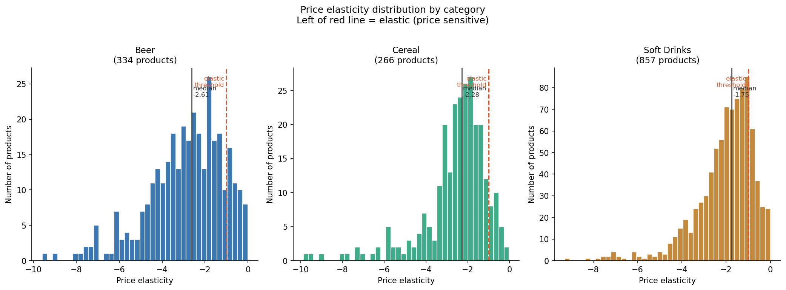
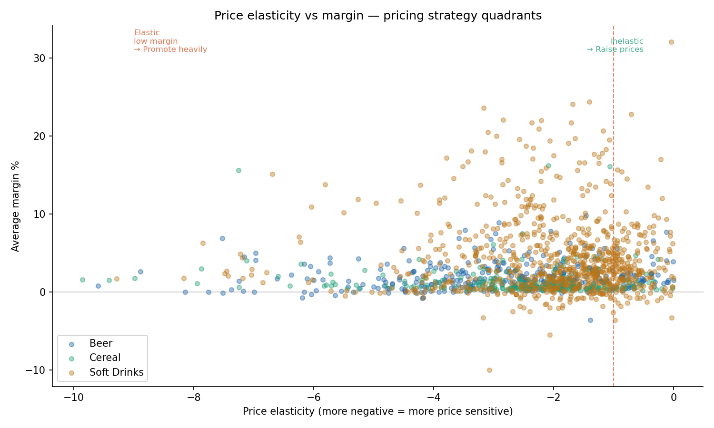
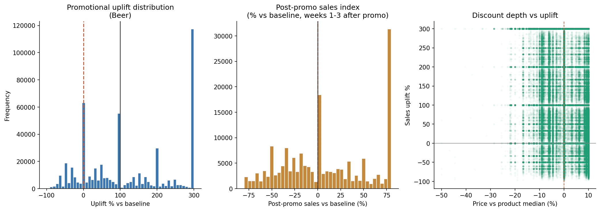
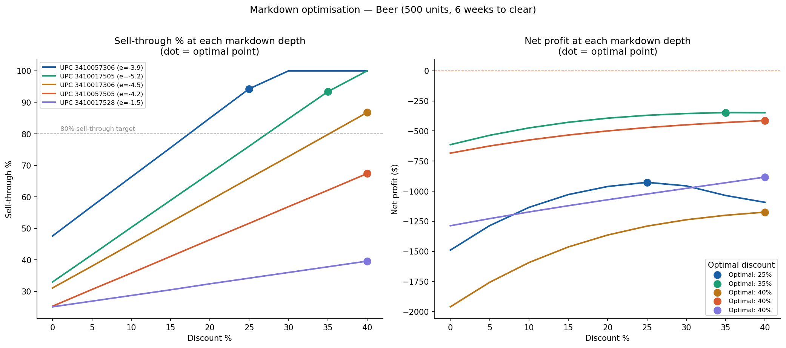
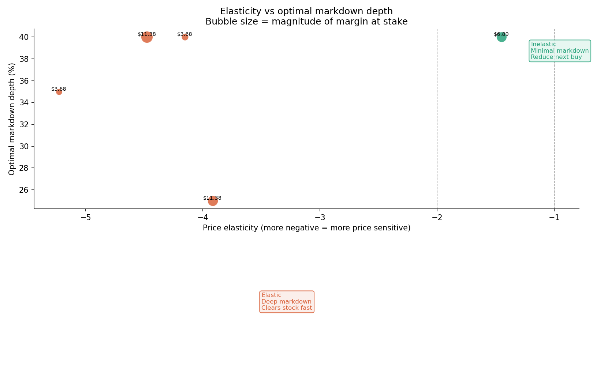

# Retail Pricing System
### Price elasticity · Promotion ROI · Markdown optimisation · 17M rows · 3 categories

---

## Overview

Built an end-to-end retail pricing analytics system on 17 million rows of real grocery scanner data from Dominick's Finer Foods — a US supermarket chain. The system answers the three most commercially important pricing questions in retail:

1. **How sensitive is demand to price changes?** (Price elasticity)
2. **Do promotions actually work — and at what cost?** (Promotional ROI)
3. **What's the optimal markdown to clear end-of-season stock?** (Markdown optimisation)

Each part builds on the previous, culminating in a recommendation engine that takes a product, its stock level, and days remaining and outputs a specific pricing action.

---

## Dataset

**Source:** [Dominick's Finer Foods — University of Chicago Booth School of Business](https://www.chicagobooth.edu/research/kilts/datasets/dominicks)

**Retailer:** Dominick's Finer Foods, Chicago area
**Categories:** Beer · Cereal · Soft Drinks
**Period:** ~6 years of weekly scanner data

| Category | Raw Rows | Clean Rows | Stores | Products | Promo Rate |
|---|---|---|---|---|---|
| Beer | 3,990,672 | 1,966,148 | 89 | 787 | 27.7% |
| Cereal | — | 4,707,776 | 93 | 489 | 7.6% |
| Soft Drinks | — | 10,741,743 | 93 | 1,608 | 31.6% |
| **Total** | — | **17,415,667** | — | **2,884** | — |

**Key columns:** `STORE` · `UPC` · `WEEK` · `MOVE` (units sold) · `PRICE` · `SALE` (promo flag) · `PROFIT` (margin in cents)

---

## Part 1 — Price Elasticity

### Method
Log-log OLS regression per product, controlling for promotional activity:

```
log(demand) = α + β₁ × log(price) + β₂ × on_promo + ε

β₁ = price elasticity coefficient
```

The log-log specification means β₁ is directly interpretable as: *"a 1% price increase causes β₁% change in demand."*

### Results

| Category | Products | Median Elasticity | % Elastic (< -1) | Median Promo Uplift |
|---|---|---|---|---|
| Beer | 334 | **-2.61** | 86.5% | 14.5% |
| Cereal | 266 | **-2.28** | 90.6% | 57.1% |
| Soft Drinks | 857 | **-1.75** | 79.6% | 45.6% |





### Key Insights

**All three categories are highly elastic.** Median elasticities of -1.75 to -2.61 mean a 10% price increase reduces demand by 17–26%. These are commodity categories where consumers actively compare prices and respond to changes.

**Soft drinks are least elastic (-1.75)** — Coke and Pepsi brand loyalty gives manufacturers more pricing power than commodity beer brands. The inelastic soft drink products in the top-right quadrant of the margin chart represent clear price increase opportunities.

**Cereal has the highest promo uplift (57%)** despite the lowest promo frequency (7.6%). When cereal goes on deal, demand jumps dramatically — suggesting price-sensitive shoppers stockpile cereal but not beer.

---

## Part 2 — Promotional ROI

### Method
1. Build a rolling 8-week median baseline from non-promotional weeks per store/UPC
2. Measure uplift as `(actual - baseline) / baseline × 100`
3. Measure pull-forward effect: compare sales in weeks 1–3 post-promotion to baseline
4. Calculate true ROI accounting for both uplift and post-promo dip

### Results

| Promo Type | Events | Median Uplift | Success Rate | Median ROI |
|---|---|---|---|---|
| S — Store feature (display + price) | 9,289 | **137.5%** | 81.1% | 137.5% |
| B — Bonus buy / multipack | 509,346 | **100.0%** | 73.6% | 100.0% |
| C — Coupon | 114 | **42.6%** | 57.9% | 42.6% |



### Key Insights

**Store features outperform all other mechanics.** Display placement combined with a price cut generates 37.5% more uplift than a bonus buy alone — and succeeds 81% of the time vs 74% for bonus buys.

**Coupons are the weakest mechanic** with only 57.9% success rate and 42.6% median uplift. For low-margin grocery categories, coupon economics rarely justify the mechanic.

**The pull-forward effect is real and significant:**
- 42% of promotional weeks are followed by a demand dip in the subsequent 1–3 weeks
- When a dip occurs, it averages **-37.2% vs baseline**
- A buyer who declares a promotion successful based on the uplift week alone is ignoring the hangover that follows

**True promotional ROI = uplift revenue − post-promo demand loss.** A promotion that generates 100% uplift but causes a 37% three-week dip has a materially lower true ROI than it appears.

---

## Part 3 — Markdown Optimisation

### Method
For each product, simulate demand and profit at 0–40% discount depths using the elasticity coefficient from Part 1:

```
new_demand = baseline_demand × (1 + elasticity × price_change_pct)
net_profit = (units_sold × discounted_price × effective_margin)
             − (unsold_units × price × 0.5)   ← write-off penalty
```

Optimal markdown = discount depth that maximises net profit given stock level and days remaining.

### Results (500 units · 6 weeks to clear · Beer)

| UPC | Price | Elasticity | Optimal Discount | Sell-Through | Action |
|---|---|---|---|---|---|
| 3410017505 | $3.68 | -5.23 | 35% | 93% | Cut to $2.39 immediately |
| 3410057505 | $3.68 | -4.15 | 40% | 67% | Cut to $2.21 immediately |
| 3410017306 | $11.38 | -4.48 | 40% | 87% | Cut to $6.83 immediately |
| 3410057306 | $11.38 | -3.92 | 25% | 94% | Cut to $8.54 in week 2 |
| **3410017528** | **$6.89** | **-1.45** | **40%** | **40%** | **Markdown won't clear — fix the buy** |





### Key Insight — The Most Important Finding

**Markdowns cannot save inelastic slow-movers.** UPC 3410017528 (elasticity -1.45) only achieves 40% sell-through even at a 40% discount. The problem is not the price — it's that demand simply doesn't respond to price changes for this product. The recommendation is to fix the initial buy quantity, not to markdown more aggressively.

**This is the finding most retailers discover too late** — after they've already marked down inventory and destroyed margin. Elasticity measurement before the buying decision would prevent the problem entirely.

---

## Recommendation Engine

```
Input:  UPC, current price, stock level, days remaining
Output: pricing strategy + specific action

Elasticity < -3 AND optimal discount ≥ 30% → Deep markdown (cut immediately)
Elasticity -3 to -2 AND optimal discount ≥ 20% → Moderate markdown (cut in week 2)
Elasticity > -1.5                              → Reduce next order (markdown won't clear)
Otherwise                                       → Staged markdown (start 10%, review weekly)
```

Sample output:
```
UPC            Price  Elasticity  Strategy            Action
3410017505    $ 3.68       -5.23  Deep markdown        Cut to $2.39 immediately
3410017306    $11.38       -4.48  Deep markdown        Cut to $6.83 immediately
3410057306    $11.38       -3.92  Moderate markdown    Cut to $8.54 in week 2
3410017528    $ 6.89       -1.45  Reduce next order    Markdown won't clear — fix the buy
```

---

## Key Findings Summary

| Finding | Implication |
|---|---|
| All 3 categories highly elastic (median -1.75 to -2.61) | Price changes have large demand impact — precision pricing matters |
| Soft drinks least elastic — brand loyalty effect | Selective price increases possible on inelastic SKUs |
| Store features generate 137.5% uplift vs 100% for bonus buys | Prioritise display + price over multipack deals |
| 42% of promotions cause post-promo dips averaging -37% | Measure true ROI across 4 weeks, not just promo week |
| Inelastic products can't be cleared by markdown | Fix over-buying at source, not at end of season |

---

## Project Structure

```
retail-pricing-system/
│
├── notebooks/
│   └── 01_pricing_analysis.ipynb    ← full 3-part analysis
│
├── charts/
│   ├── elasticity_distribution.png  ← Part 1: elasticity by category
│   ├── elasticity_vs_margin.png     ← Part 1: strategy quadrants
│   ├── promo_uplift.png             ← Part 2: uplift + pull-forward
│   ├── markdown_curves.png          ← Part 3: sell-through curves
│   └── markdown_strategy_matrix.png ← Part 3: elasticity vs markdown
│
└── README.md
```

---

## Setup

```bash
git clone https://github.com/KaraboMosala/retail-pricing-system
cd retail-pricing-system
pip install pandas numpy scikit-learn matplotlib
```

Request the Dominick's dataset at [UChicago Booth](https://www.chicagobooth.edu/research/kilts/datasets/dominicks). Download `wber.csv`, `wcer.csv`, and `wsdr.csv` and update the `BASE` path in the notebook.


## Author

**Karabo Mosala** 

---

*Dataset: Dominick's Finer Foods via the James M. Kilts Center, University of Chicago Booth School of Business.*